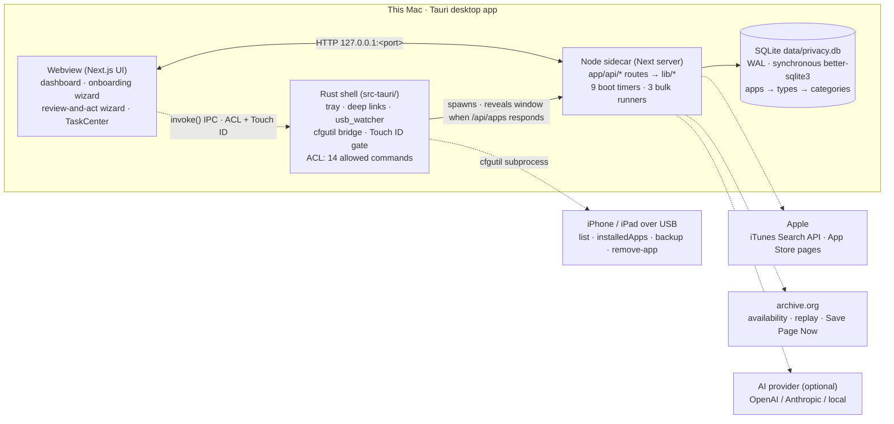
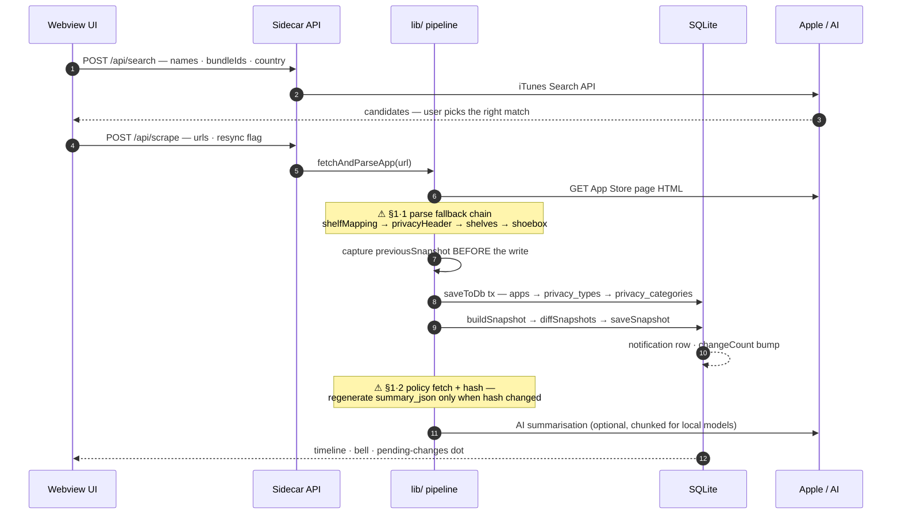
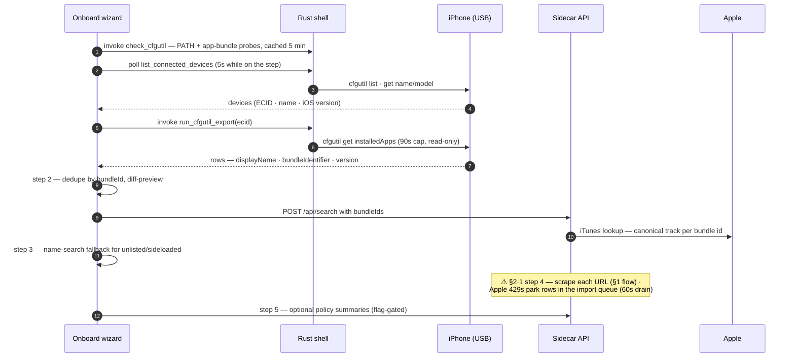
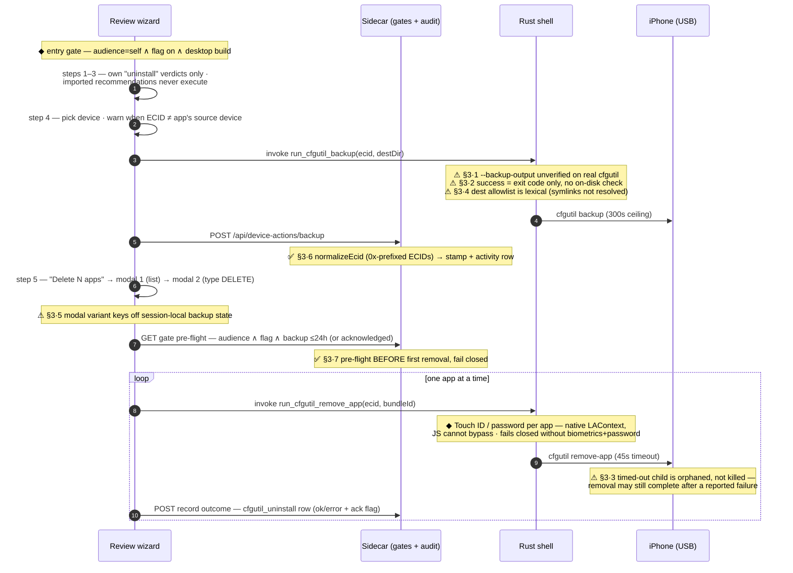
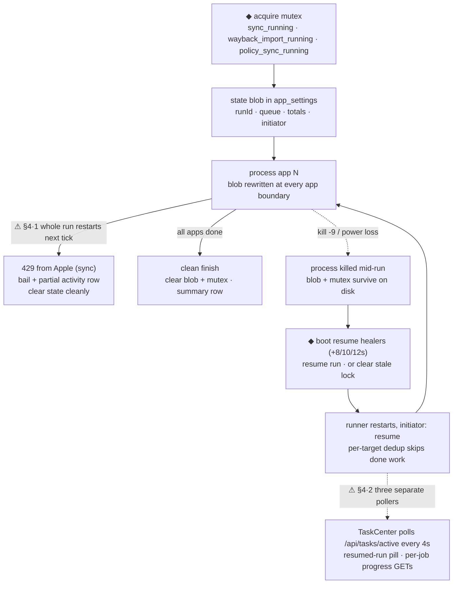
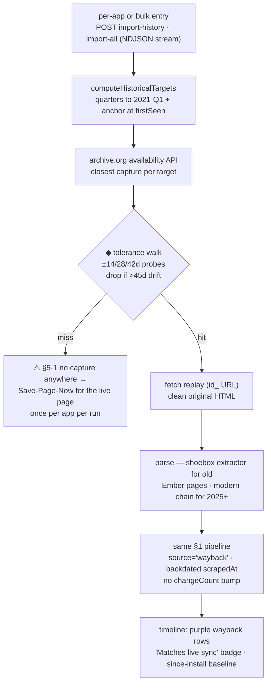
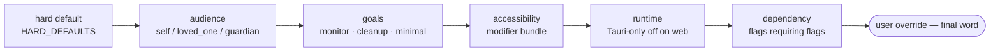

# Architecture & workflows, end to end

Every process the app runs — from typing an app name to deleting one off a plugged-in
iPhone — drawn as flow diagrams across the runtimes, with known weak points marked where
they live. Companion to the prose in [AGENTS.md](../AGENTS.md) and the hosted docs at
[privacytracker-docs.privacykey.org](https://privacytracker-docs.privacykey.org/develop/architecture).

**How to read the markers.** `⚠ §N·M` = open finding, `✅ §N·M` = fixed. Every marker is a
row in the [improvement backlog](#7--improvement-backlog) at the bottom. When you fix one,
update its row and the diagram label in the same PR.

*Findings audited against source on 2026-07-06 (branch `feat/eager-shannon-b87c90`).*

---

## 0 · System map

The desktop app is a Tauri shell that boots a private Next.js server (the "sidecar") on a
random localhost port, then points its webview at it. Everything privacy-critical happens
on this machine: scraping, diffing, AI calls, and the SQLite database. The Rust shell is
the only piece that can touch a connected iPhone. The web/Docker build is the same server
without the shell column.

Boot handshake: `sidecar::boot()` binds `127.0.0.1:0` for a free port, spawns Node with
`PORT`/`PRIVACYTRACKER_DATA_DIR`, polls `GET /api/apps` (≤60s), then navigates the webview
and reveals the window (optionally behind a Touch ID unlock). Files:
`src-tauri/src/main.rs`, `src-tauri/src/sidecar.rs`.

---

## 1 · Add & track an app (the core loop)

The pipeline every other flow feeds into. A name becomes an App Store URL, the URL becomes
parsed privacy labels, and every re-sync diffs against the previous snapshot to produce
the change timeline and notifications. Re-syncs run the same path with `resync=true`.
Files: `lib/scraper.ts`, `lib/changelog.ts`, `lib/privacy-policy.ts`.

---

## 2 · Import your apps from a device (cfgutil)

Onboarding (`OnboardWizard.tsx`, five steps: choose method → import & reconcile → confirm
matches → import progress → policy summaries) accepts four sources: screenshots (OCR),
CSV/TXT upload, manual typing, and — on macOS with Apple Configurator — a live `cfgutil`
export. The cfgutil path is **read-only against the device**. There is no scheduled device
re-sync: a USB plug-in event (IOKit watcher → `DeviceConnectedToast`) re-opens this flow
on demand. Files: `src-tauri/src/cfgutil.rs`, `lib/desktop.ts`, `src-tauri/src/usb_watcher.rs`.

Non-Mac alternative: `scripts/ios-app-import/export_ios_apps.py` (stdlib-only) produces a
`.txt`/`.csv` the user feeds back into the CSV path (⚠ §2·2 — manual round-trip).

---

## 3 · Back up, then delete apps off the phone

The only destructive flow in the product, so it runs the deepest gate stack: audience must
be `self`, an off-by-default Developer Options flag, a fresh backup (≤24h) or an explicit
typed acknowledgement, two confirm modals, a server-side pre-flight, and finally a native
Touch ID prompt per app that JavaScript cannot bypass. One cfgutil call per app — there is
deliberately no batch primitive. Files: `app/components/ReviewRecommendationsView.tsx`,
`lib/device-actions.ts`, `app/api/device-actions/*`, `src-tauri/src/cfgutil.rs`,
`src-tauri/src/touch_id.rs`.

---

## 4 · Background jobs & crash-safe resume

Server boot (`instrumentation.ts`) arms nine timers. Three bulk runners (App Store sync,
Wayback import, policy sync) share one crash-safety pattern: a mutex key plus a state blob
in `app_settings`, rewritten at every app boundary — a process kill loses at most one
app's work, and boot-time healers resume or clear what's left.

| When | What | Then every |
| --- | --- | --- |
| t=0 | watchdog · error ring · diagnostics · feature-flag migration · clear `import_queue_running`/`health_check_running` stale locks | — |
| +8s / +10s / +12s | resume healers: wayback → sync → policy (resume pending run, or clear a stale mutex) | on boot |
| +15s | scheduler tick — `getSchedulerStatus().isDue` (daily/weekly/manual) → `runBulkSync` | 30 min |
| +20s | import-queue drain (rows parked by onboarding 429s) | 60 s |
| +25s | update check (GitHub, 24h response cache) | 6 h |
| +35s | whole-DB backup snapshots (`lib/backup.ts`, signed JSON — distinct from device backups) | 30 min |
| +60s | health check — PASSIVE WAL checkpoint, clear provably-dead locks, report-only memory/orphan checks | 24 h |

The resume healers are staggered *before* the 60s health check so a freshly-resumed run is
never mistaken for a dead lock.

Apple 429 handling is deliberate: an expected, recoverable condition clears state cleanly
(unlike a crash) so the next 30-minute tick retries fresh.

---

## 5 · Wayback: back-filling label history to 2021

Reconstructs an app's privacy-label history from archive.org — one target per quarter back
to Q1 2021 plus an "install anchor" at `apps.firstSeen`, so the since-install diff has a
real baseline. Read-only against the archive except one Save-Page-Now request per app when
a quarter has no usable capture. Files: `lib/historical-import.ts`, `lib/wayback-bulk-runner.ts`.

---

## 6 · The gate chain every surface answers to

Whether any card, step, or destructive action exists at all is resolved through one
layered chain — later stages override earlier ones, user override always wins. The §3 flow
adds two hard gates on top (backup freshness, Touch ID) that no flag can soften.

Kill-switch: `flag.devopts.feature_flag_system.enabled=off` collapses everything to hard
defaults without a code rollback. The delete flow's `flag.devopts.cfgutil_uninstall`
defaults to **off**, and the audience gate is enforced in code — flipping the flag on
under `guardian` still shows nothing. Modules: `lib/feature-flag-rules.ts`,
`lib/feature-flags*.ts` (see AGENTS.md for the five-module split).

---

## 7 · Improvement backlog

Point-in-time (2026-07-06). Refs match the `⚠`/`✅` markers in the diagrams above. Prune or
flip rows as they land, and update the diagram label in the same PR.

| Ref | Area | Status | Finding → candidate improvement | Effort |
| --- | --- | --- | --- | --- |
| §3·1 | Device backup | **open · high** | `cfgutil backup --backup-output` appears in no public cfgutil docs (canonical: `backup` takes no options, writes to MobileSync). Verify `cfgutil help backup` on a Mac with Configurator; if rejected, run plain `backup` and resolve the real path via `list-backups`. | S–M |
| §3·2 | Device backup | **open · high** | Backup success is exit-code only. Verify on disk (dir non-empty / `Manifest.db`) before stamping; never record a fallback path that wasn't observed. | S |
| §3·3 | Device delete | open | `run_with_timeout` orphans the cfgutil child on timeout — "failed" can silently become "succeeded later". Kill the process group, or re-check installed state after timeout and correct the audit row. | S |
| §3·4 | Device backup | open | `resolve_backup_dest` claims symlink protection but checks lexically. Canonicalise the existing ancestor, or fix the comment. | S |
| §3·5 | Delete UX / audit | open | Final modal's backup variant + acknowledge flag key off session-local state. Drive both from the server stamp (GET gate) so audit rows stop over-reporting "no backup acknowledged". Spec ready: [docs/specs/3-5-server-stamp-backup-variant.md](specs/3-5-server-stamp-backup-variant.md). | S |
| §3·6 | Device actions | ✅ fixed | ECID normalisation (`0x`-prefixed) across stamp store, gate, and routes; pinned by tests with real-format ECIDs. | — |
| §3·7 | Device actions | ✅ fixed | Server gate pre-flights before the first removal (fail closed); recording failures surface in the UI. | — |
| §1·1 | Scraper | open | No parser canary. Add fixture tests against recorded App Store HTML + an alert/activity row when a scrape parses zero privacy types for an app that previously had them. | M |
| §1·2 | AI summaries | idea | Summarisation silently degrades without a provider; chunking for local models is heuristic. Consider a visible "summary stale/unavailable" state. | S |
| §2·1 / §4·1 | Rate limiting | open | On 429 the bulk sync abandons the run and restarts the whole fleet next tick. Resume from the state blob's cursor instead; consider shared per-app backoff with the import queue. | M |
| §2·2 | Cross-platform import | idea | Python export needs a manual round-trip. Drag-drop hint or watch-folder hand-off. | M |
| §4·2 | Polling | idea | Three pollers (TaskCenter 4s, notification watcher, per-job GETs) → one SSE stream from the sidecar. | L |
| §5·1 | Wayback | idea | Track quarters skipped for lack of captures and offer "retry skipped" once Save-Page-Now requests have had time to land. | S–M |

Suggested order: §3·1 and §3·2 first (they decide whether "we back up before deleting" is
true at all), then §1·1 (protects the core product), then §3·3/§3·4/§3·5 as one small
hardening PR, then the rate-limit resume (§2·1/§4·1).

---

## Keeping this document honest

- Diagrams are Mermaid — edit them in place; GitHub renders them natively.
- The backlog is point-in-time by design. When a finding is fixed, flip its row to ✅ and
  update the matching `⚠` label in the diagram in the same PR (or delete both once stale).
- Timings (boot delays, poll intervals, timeouts) were read from source on the date above;
  if you change one in code, grep this file for the old value.
